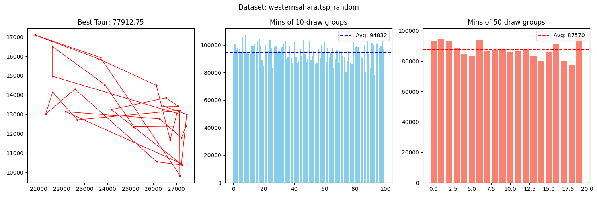
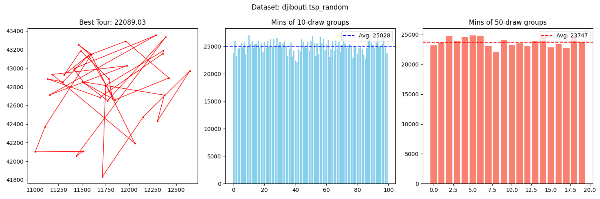
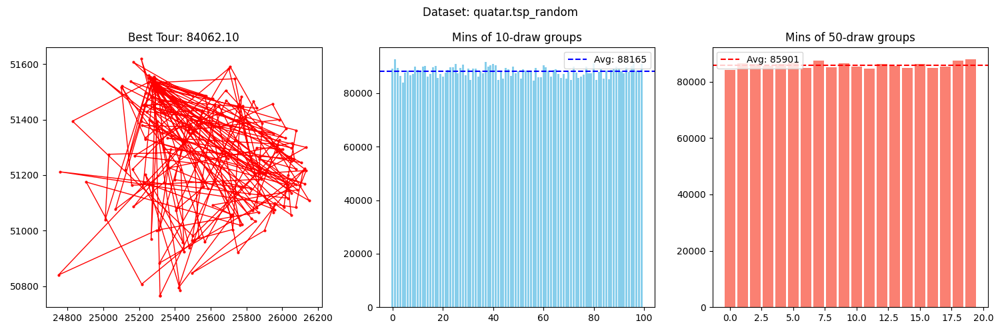
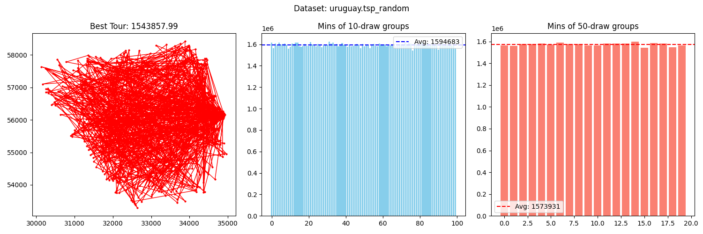
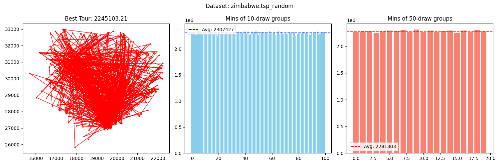
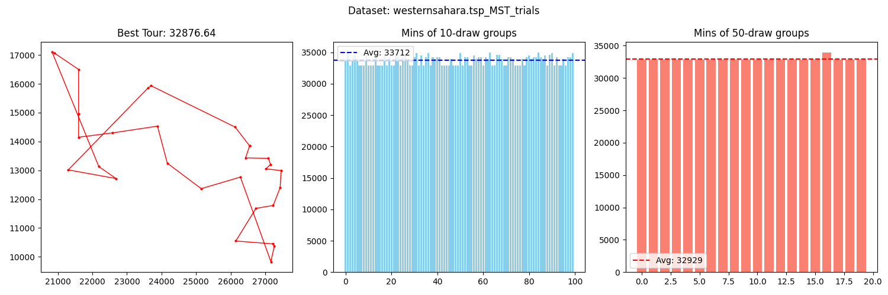
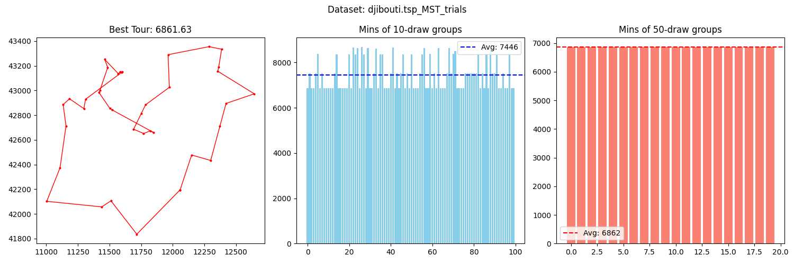
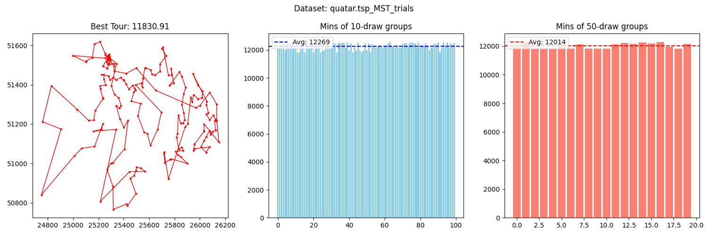
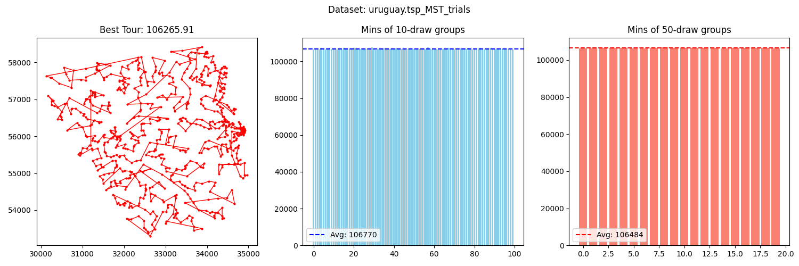
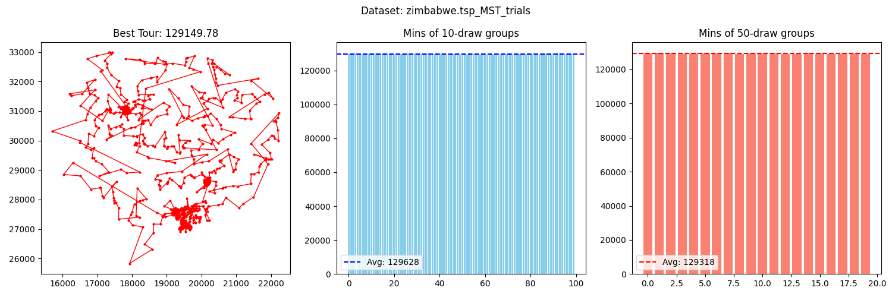

# Lista 0 - Algorytmy Metaheurystyczne

Dla każdego zbioru:
- wygenerowano 1000 losowych permutacji,
- obliczono:
    - średnią z minimum dla grup po 10 prób,
    - średnią z minimum dla grup po 50 prób,
    - minimalną wartość globalną,
- porównano z rozwiązaniem opartym na MST:
    - wygenerowano MST dla *n* wierzchołków początkowych
    - wybrano najlepsze rozwiązanie

## Wyniki – Losowe permutacje

### Western Sahara

### Djibouti

### Quatar

### Uruguay

### Zimbabwe

**Wniosek:**  
Losowe rozwiązania mają dużą wariancję. Grupowanie (10 i 50 prób) nieco stabilizuje wyniki, nadal dalekie od optymalnych.

## Wyniki – MST

### Western Sahara

### Djibouti

### Quatar

### Uruguay

### Zimbabwe

**Wniosek:**  
Rozwiązanie oparte na MST daje znacznie lepsze i stabilniejsze wyniki niż losowe permutacje.

## Obserwacje

- W przestrzeni euklidesowej optymalny cykl *nie zawiera przecinających się krawędzi* - cięcia występujące w MST możnaby usunąć co poprawi rozwiązanie

  

Jan Ryszkiewicz 
282210

